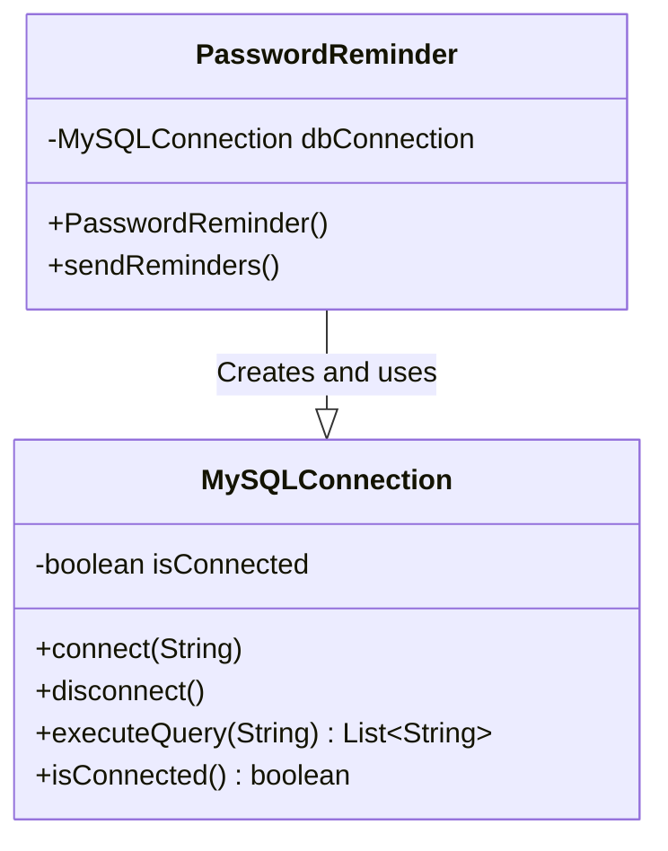
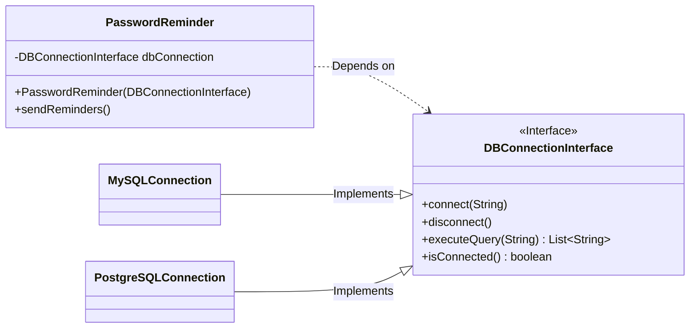

# Tugas Asinkronus M11: Mencapai Loose Coupling dengan Dependency Injection

**Topik:** Loose Coupling & Dependency Inversion Principle (DIP)
**Tujuan:** Setelah menyelesaikan tugas ini, Anda diharapkan mampu:
1.  Mengidentifikasi masalah yang disebabkan oleh ketergantungan kaku (*tight coupling*) dalam kode.
2.  Menjelaskan manfaat dari prinsip inversi ketergantungan (DIP).
3.  Menerapkan refactoring pada kode untuk mencapai *loose coupling* menggunakan *interface* dan *dependency injection*.

---

## Dasar Teori: Prinsip vs Pola

Sebelum memulai, penting untuk memahami perbedaan antara dua konsep kunci:

1.  **Dependency Inversion Principle (DIP):** Ini adalah **Prinsip Desain** (aturan) tingkat tinggi. Aturan ini menyatakan bahwa modul level tinggi (misal: logika bisnis) tidak boleh bergantung pada modul level rendah (misal: detail koneksi database). Keduanya harus bergantung pada **abstraksi** (misalnya, sebuah `interface`). Tujuannya adalah membalik arah ketergantungan untuk menciptakan sistem yang fleksibel (*loose coupling*).

2.  **Dependency Injection (DI):** Ini adalah **Pola Desain** (cara) untuk menerapkan DIP. Ini adalah **aksi** memberikan (menyuntikkan) objek dependensi ke sebuah kelas dari luar, alih-alih membiarkan kelas itu membuatnya sendiri. Cara paling umum adalah melalui *constructor* (disebut *Constructor Injection*).

Singkatnya: Kita mengikuti **Prinsip** DIP dengan menerapkan **Pola** DI.

---

## Konteks: Skenario Awal - Ketergantungan yang Kaku

Bayangkan Anda sedang membangun sebuah fitur pengingat password. Logika bisnisnya cukup jelas: sambungkan ke database, jalankan query untuk mencari pengguna yang perlu diingatkan, kirim pengingat, lalu putuskan koneksi.

Dengan sigap, Anda menulis kode yang terikat langsung dengan implementasi `MySQLConnection`:

```java
import java.util.List;
import java.util.Arrays;

// Modul Level Rendah (Detail Implementasi Koneksi)
class MySQLConnection {
    private boolean isConnected = false;

    public void connect(String connectionString) {
        System.out.println("MySQL: Connecting using '" + connectionString + "'");
        this.isConnected = true;
        System.out.println("MySQL: Connection established.");
    }

    public void disconnect() {
        System.out.println("MySQL: Connection closed.");
        this.isConnected = false;
    }

    public List<String> executeQuery(String query) {
        if (!isConnected) {
            throw new IllegalStateException("Not connected to MySQL database!");
        }
        System.out.println("MySQL: Executing query '" + query + "'");
        // Simulasi hasil query
        return Arrays.asList("user1@example.com", "user2@example.com");
    }

    public boolean isConnected() {
        return this.isConnected;
    }
}

// Modul Level Tinggi (Logika Bisnis Aplikasi)
class PasswordReminder {
    private MySQLConnection dbConnection;

    public PasswordReminder() {
        // Ketergantungan KAKU! PasswordReminder tahu detail implementasi MySQL.
        this.dbConnection = new MySQLConnection();
    }

    public void sendReminders() {
        // Logika bisnis terikat erat dengan detail koneksi
        dbConnection.connect("jdbc:mysql://localhost/prod_db");
        
        if (dbConnection.isConnected()) {
            List<String> usersToRemind = dbConnection.executeQuery("SELECT email FROM users WHERE reminder_due = true");
            System.out.println("Found " + usersToRemind.size() + " users to remind.");

            for(String userEmail : usersToRemind) {
                System.out.println("Sending reminder to: " + userEmail);
            }
        }
        
        dbConnection.disconnect();
    }
}
```

### Masalah yang Tersembunyi

Kode di atas terlihat logis, namun desainnya rapuh karena **Tight Coupling**. `PasswordReminder` tidak hanya tahu bahwa ia butuh "koneksi", tetapi ia tahu semua detail tentang `MySQLConnection`: cara membuatnya (`new`), method spesifiknya, bahkan format `connectionString`-nya. Ini menciptakan masalah serius seperti sulit diuji, tidak fleksibel, dan melanggar prinsip *Open/Closed*.

Tugas Anda adalah memperbaiki desain ini.

---

## Visualisasi Perubahan Dependensi

#### Sebelum Refactoring (Tight Coupling)

`PasswordReminder` bergantung langsung pada `MySQLConnection`.



#### Sesudah Refactoring (Loose Coupling)

`PasswordReminder` hanya bergantung pada `DBConnectionInterface`.


*Perhatikan, `PasswordReminder` setelah di-refactor tidak berubah meskipun implementasi detail (`MySQLConnection` atau `PostgreSQLConnection`) memiliki logika internal yang berbeda.*

---

## Bagian 1: Analisis Awal & Membaca Diagram

Jawablah pertanyaan-pertanyaan berikut dalam file `jawaban.md`. Fokus utama bagian ini adalah untuk memperdalam pemahaman Anda dalam membaca dan menginterpretasikan **Class Diagram** serta menghubungkannya dengan implementasi kode.

1.  **Analisis Kode:** Perhatikan kode `PasswordReminder` yang terikat pada `MySQLConnection`.
    - Apa yang akan terjadi pada kelas `PasswordReminder` jika method `connect` di `MySQLConnection` diubah parameternya menjadi `connect(String user, String pass)`? Di baris kode mana masalah akan muncul?
    - Apa yang akan terjadi pada kelas `PasswordReminder` jika method `executeQuery` di `MySQLConnection` diubah agar mengembalikan `String[]` (sebuah array) dan bukan `List<String>`? Perubahan apa yang harus Anda lakukan di `PasswordReminder` untuk menyesuaikannya?

2.  **Analisis Diagram:** Perhatikan **Class Diagram "Sebelum Refactoring"**.
    - Garis panah pada diagram menunjukkan bahwa `PasswordReminder` memiliki dependensi kaku ke `MySQLConnection`. Baris kode manakah di dalam kelas `PasswordReminder` yang paling bertanggung jawab atas terciptanya garis dependensi ini?
    - Jelaskan mengapa dependensi ini membuat `PasswordReminder` sangat sulit diuji secara terpisah (misalnya untuk *unit testing*) tanpa harus menyediakan database MySQL yang aktif.

---

## Bagian 2: Misi Refactoring

Tujuan Anda adalah mengubah kode menjadi *loosely coupled*, sesuai arsitektur pada **Class Diagram "Sesudah Refactoring"**. Tulis semua kode dalam satu file `RefactoredCode.java`.

**Langkah 1: Buat "Kontrak" (Interface) yang Diperkaya**
Buat `interface` `DBConnectionInterface` dengan semua method yang dibutuhkan.
```java
import java.util.List;

public interface DBConnectionInterface {
    void connect(String connectionInfo);
    void disconnect();
    List<String> executeQuery(String query);
    boolean isConnected();
}
```
*Ini adalah abstraksi atau "kontrak" utama kita.*

**Langkah 2: Patuhi "Kontrak"**
Ubah `MySQLConnection` agar mengimplementasikan `DBConnectionInterface`.
```java
// Ubah kelas ini
class MySQLConnection implements DBConnectionInterface {
    private boolean isConnected = false;

    @Override
    public void connect(String connectionString) {
        System.out.println("MySQL: Connecting using '" + connectionString + "'");
        this.isConnected = true;
        System.out.println("MySQL: Connection established.");
    }

    @Override
    public void disconnect() {
        System.out.println("MySQL: Connection closed.");
        this.isConnected = false;
    }

    @Override
    public List<String> executeQuery(String query) {
        if (!isConnected()) {
            throw new IllegalStateException("Not connected to MySQL database!");
        }
        System.out.println("MySQL: Executing query '" + query + "'");
        return Arrays.asList("user1@example.com", "user2@example.com");
    }

    @Override
    public boolean isConnected() {
        return this.isConnected;
    }
}
```
*Ini adalah implementasi konkret pertama dari kontrak kita.*

**Langkah 3: Balikkan Ketergantungan (Invert the Dependency)**
Refactor `PasswordReminder` agar bergantung pada `DBConnectionInterface`.
```java
// Refactor kelas ini
class PasswordReminder {
    private final DBConnectionInterface dbConnection;

    // Suntikkan dependensi melalui constructor
    public PasswordReminder(DBConnectionInterface dbConnection) {
        this.dbConnection = dbConnection;
    }

    public void sendReminders() {
        // Logika bisnis tidak lagi tahu implementasi, hanya tahu kontrak!
        // Connection string sekarang menjadi tanggung jawab pemanggil.
        dbConnection.connect("jdbc:mysql://localhost/prod_db");
        
        if (dbConnection.isConnected()) {
            List<String> usersToRemind = dbConnection.executeQuery("SELECT email FROM users WHERE reminder_due = true");
            System.out.println("Found " + usersToRemind.size() + " users to remind.");

            for(String userEmail : usersToRemind) {
                System.out.println("Sending reminder to: " + userEmail);
            }
        }
        
        dbConnection.disconnect();
    }
}
```
*Inilah inti dari DIP. `PasswordReminder` sekarang fleksibel.*

**Langkah 4: Buat Implementasi Baru yang Fleksibel**
Buat kelas `PostgreSQLConnection` yang juga mengimplementasikan `DBConnectionInterface`.
```java
// Buat kelas baru ini
class PostgreSQLConnection implements DBConnectionInterface {
    private boolean isConnected = false;
    
    @Override
    public void connect(String connectionInfo) {
        System.out.println("PostgreSQL: Connecting with '" + connectionInfo + "'");
        this.isConnected = true;
        System.out.println("PostgreSQL: Connection ready.");
    }

    @Override
    public void disconnect() {
        System.out.println("PostgreSQL: Disconnected.");
        this.isConnected = false;
    }

    @Override
    public List<String> executeQuery(String query) {
        if (!isConnected()) {
            throw new IllegalStateException("Not connected to PostgreSQL!");
        }
        System.out.println("PostgreSQL: Running query '" + query + "'");
        return Arrays.asList("pg_user_A@example.com", "pg_user_B@example.com");
    }

    @Override
    public boolean isConnected() {
        return this.isConnected;
    }
}
```
*Kita bisa membuat implementasi sebanyak yang kita mau tanpa mengubah `PasswordReminder`.*

### Eksplorasi Tambahan (Opsional)

Untuk memperdalam pemahaman Anda, coba tantangan dan pertanyaan reflektif berikut. Jawablah pertanyaan dalam `jawaban.md` Anda.

**Bagian A: Implementasi & Penggunaan Koneksi "Simulasi"**

1.  **Buat Koneksi "Simulasi":** Selain `MySQLConnection` dan `PostgreSQLConnection`, buatlah satu lagi kelas yang mengimplementasikan `DBConnectionInterface` bernama `SimulatedConnection`. Method `connect()` di dalam kelas ini tidak perlu terhubung ke database sungguhan, cukup mencetak pesan seperti `"SimulatedConnection: Simulasi koneksi untuk development."` dan method `executeQuery()` bisa mengembalikan `Arrays.asList("simulated_user1@example.com")`. Pastikan semua method `DBConnectionInterface` diimplementasikan.
2.  **Gunakan Koneksi "Simulasi":** Coba jalankan `PasswordReminder` dengan menyuntikkan objek `SimulatedConnection` Anda di method `main`.
3.  **Jelaskan Kegunaannya:** Menurut Anda, dalam situasi apa memiliki kelas "koneksi simulasi" seperti `SimulatedConnection` ini bisa sangat berguna selama proses pengembangan perangkat lunak?

**Bagian B: Refleksi Kritis terhadap Desain**

Perhatikan method `sendReminders` di kelas `PasswordReminder` yang sudah di-refactor. Di dalamnya, kita masih menulis kode `dbConnection.connect("jdbc:mysql://localhost/prod_db");`.

1.  Meskipun `PasswordReminder` sekarang sudah tidak terikat pada kelas `MySQLConnection`, ia masih memiliki "pengetahuan" tentang `connection string` yang spesifik untuk MySQL. Menurut Anda, apakah ini masih bisa dianggap sebagai sebuah masalah atau "bau kode" (*code smell*) dalam desain kita? Jelaskan argumen Anda.
2.  Tanpa perlu menulis kode, dapatkan Anda membayangkan sebuah cara atau strategi agar kelas `PasswordReminder` sama sekali tidak perlu tahu tentang detail `connectionString`? Jelaskan idenya secara konseptual.

---

## Bagian 3: Pembuktian & Refleksi

**Langkah 5: Uji Fleksibilitas Kode Anda**
Buat `main` method untuk membuktikan bahwa `PasswordReminder` bisa bekerja dengan kedua implementasi.
```java
public class Main {
    public static void main(String[] args) {
        System.out.println("--- SCENARIO 1: USING MYSQL ---");
        // Kita bisa membuat object MySQLConnection
        DBConnectionInterface mySQL = new MySQLConnection();
        // dan menyuntikkannya ke PasswordReminder
        PasswordReminder reminderMySQL = new PasswordReminder(mySQL);
        reminderMySQL.sendReminders();

        System.out.println("--- SCENARIO 2: SWITCHING TO POSTGRESQL ---");
        // Cukup ganti object yang kita suntikkan
        DBConnectionInterface postgreSQL = new PostgreSQLConnection();
        // PasswordReminder tidak perlu diubah sama sekali
        PasswordReminder reminderPostgreSQL = new PasswordReminder(postgreSQL);
        // Perhatikan bahwa connection string bisa berbeda untuk tiap database
        reminderPostgreSQL.sendReminders(); // Di dunia nyata, string ini akan berbeda
    }
}
```

**Langkah 6: Jawab Pertanyaan Refleksi**
Dalam file `jawaban.md` Anda, jawablah pertanyaan-pertanyaan berikut:

2.  Perhatikan *constructor* baru pada kelas `PasswordReminder`. Apa keuntungan utama dari memberikan objek dependensi (seperti `MySQLConnection`) melalui *constructor* dibandingkan membiarkan `PasswordReminder` membuatnya sendiri?
3.  **Kaitkan dengan Class Diagram:** Perhatikan kembali **Class Diagram "Sesudah Refactoring"**. Jelaskan bagaimana hasil eksekusi kode di `main` method (Langkah 5) membuktikan bahwa `PasswordReminder` sekarang bergantung pada `DBConnectionInterface` dan bukan pada implementasi konkret (`MySQLConnection` atau `PostgreSQLConnection`). Fokus pada bagaimana panah dependensi pada diagram tercermin dalam fleksibilitas kode yang Anda amati.

---

## Instruksi Pengumpulan

Kumpulkan tugas Anda dalam format berikut:

1.  **Struktur File Kode:** Buatlah beberapa file `.java` terpisah untuk setiap komponen. Pastikan nama file sama persis dengan nama `public class` atau `interface` di dalamnya. Anda akan memiliki file-file berikut:
    - `DBConnectionInterface.java`
    - `MySQLConnection.java`
    - `PostgreSQLConnection.java`
    - `PasswordReminder.java`
    - `Main.java`
    - `SimulatedConnection.java` (jika Anda mengerjakan Bagian A dari Eksplorasi Tambahan)

2.  **File Jawaban:** Buat satu file Markdown bernama `jawaban.md` yang berisi semua jawaban Anda untuk pertanyaan-pertanyaan di Bagian 1, Bagian 2 (Eksplorasi Tambahan), dan Bagian 3.

3.  **Pengumpulan:** Kompres semua file `.java` dan file `jawaban.md` Anda ke dalam satu file ZIP dengan format nama `nrp_nama_asinkron12.zip` (misal: `205150400111001_Budi_asinkron12.zip`) dan kumpulkan sesuai dengan instruksi di platform e-learning.
